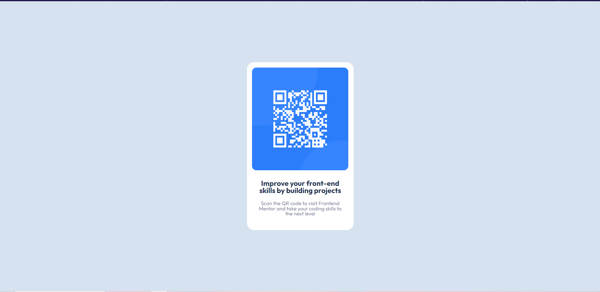

# Frontend Mentor - QR code component solution

Esta é uma solução para o [QR code component challenge on Frontend Mentor](https://www.frontendmentor.io/challenges/qr-code-component-iux_sIO_H). Frontend Mentor desafios ajudam você a melhorar suas habilidades de codificação criando projetos realistas.

## Sumário

- [Visão Geral](#visao-geral)
  - [Screenshot](#screenshot)
  - [Links](#links)
- [Meu Processo](#meu-processo)
  - [Construido com](#construido-com)
  - [O que eu aprendi](#oque-eu-aprendi)
- [Autor](#autor)

## Visão Geral

### Screenshot

### Links

- Live Site URL: (https://your-live-site-url.com)

## Meu Processo

### Construido com 

- HTML5 semantico 
- propriedades CSS personalizadas
- Flexbox

### O que eu aprendi

Com esse exercício pude aprimorar meus conhecimentos básicos em tag semanticas HTML e também como fazer a centralização de elementos utilizando flexbox.

## Autor

- Website - (https://mariovictor100.github.io/PaginaPessoal/)
- Frontend Mentor - (https://www.frontendmentor.io/profile/MarioVictor100)
- Twitter - [@mariovictor2014](https://twitter.com/mariovictor2014)